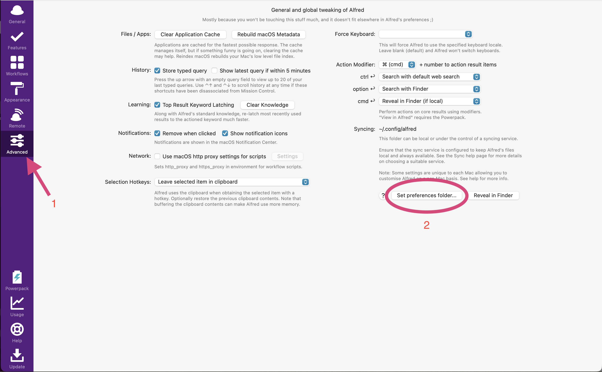

# Taka's dotfiles

Here's my dotfiles management repository run with [chezmoi](https://www.chezmoi.io/reference/commands/apply/)  
Setup once, use them everywhere.


## Alfred
After syncing the setting files under ```~/.config/alfred```, you have to specify that from Alfred app as a preference folder.

